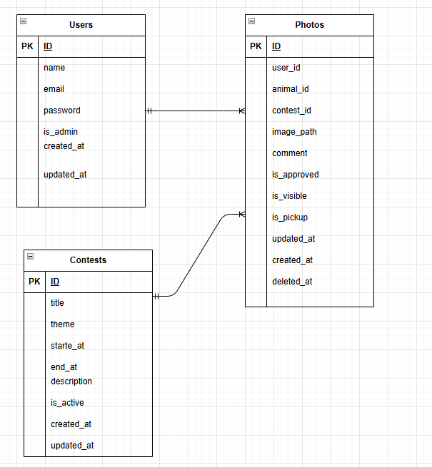

# 西山動物園フォトコンテストアプリ

## 概要

- 福井県鯖江市「西山動物園にもっと行きたくなる」をテーマにしたフォトコンテスト・写真投稿アプリです。
- 来園者が撮影した動物写真を投稿・共有でき、管理者は投稿写真の承認やコンテスト管理を行えます。

## 主な機能

### 一般ユーザー

- ユーザー登録・ログイン
- 写真投稿
- 動物を選択してコメント付きで投稿
- 写真一覧表示
- クリックするとモーダルで拡大表示
- マイページで自分の投稿一覧を確認できる・削除できる

### 管理者

- 投稿写真管理（投稿の承認／却下／非表示切替）
- PICK UP 設定（トップページ掲載）
- コンテスト管理（コンテスト作成・編集・終了）
- 応募写真のステータス管理（承認待ち／承認済み／却下）
- ユーザー管理

### トップページ

- 営業時間表示（休園日ロジックあり）
- コンテスト開催告知
- PICK UP写真一覧
- トピック／イベント表示

## 開発環境

- Laravel 10.x
- PHP 8.1
- MySQL 8
- Nginx
- Docker / Docker Compose

## 管理者ユーザーと一般ユーザーのログイン情報

### 管理者ユーザー

- メールアドレス：admin@example.com
- パスワード：password

### 一般ユーザー

- メールアドレス：test1@example.com
- パスワード：password

## ER図  

- index.drawio.pngに記載
- 

## URL　　

- 開発環境：http://localhost/

## セットアップ手順

- リポジトリをクローン

git clone https://github.com/madoka-ichinose/nishiyama_zoo.git
cd nishiyama_zoo

- 環境ファイルをコピー

cd src
cp .env.example .env

- コンテナ起動

docker-compose up -d --build

- 依存関係インストール

docker-compose exec app composer install
docker-compose exec app npm install && npm run dev

- アプリキー生成

docker-compose exec app php artisan key:generate

- マイグレーション & シーディング

docker-compose exec app php artisan migrate --seed

- ディレクトリ構成（主要部分）
src/
├── app/
│   ├── Http/Controllers/   # コントローラ（User, Admin, Contest, Photoなど）
│   ├── Models/             # モデル（User, Photo, Animal, Contest...）
│   └── ...
├── resources/views/        # Bladeテンプレート
│   ├── photos/             # 一般ユーザーの写真ページ
│   ├── mypage/             # マイページ
│   └── admin/              # 管理者ページ
├── public/
│   ├── images/             # ダミー画像置き場
│   └── storage/            # アップロード写真（symlinkでstorageにリンク）
└── database/seeders/       # Seeder（AnimalsTableSeeder, PhotosTableSeeder...）
